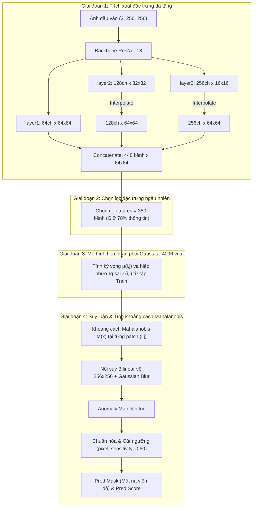

# Kiến Trúc & Hướng Dẫn Kỹ Thuật Mô Hình PaDiM Version 2

Tài liệu này ghi chú chi tiết toàn bộ kiến trúc, cơ chế toán học, luồng xử lý dữ liệu (Input/Output), cách thức tạo mặt nạ dự đoán (`Pred Mask`) và các cải tiến quan trọng của mô hình **PaDiM Version 2** trên tập dữ liệu **Carpet** (bắt thành công $100\%$ khuyết tật, bao gồm cả khuyết tật kim loại siêu mảnh `metal_contamination/000.png`).

---

## 1. Tổng Quan Về PaDiM Version 2

* **Tên gọi**: **PaDiM** (*Patch Distribution Modeling Framework for Anomaly Detection and Localization* - ICPR 2020).
* **Trường phái**: Mô hình tham số thống kê (Parametric Statistical Modeling) dựa trên phân phối chuẩn đa biến (Multivariate Gaussian).
* **Mục tiêu cải tiến ở Version 2**: Khắc phục hiện tượng bỏ sót các khuyết tật có kích thước siêu nhỏ/mảnh (như sợi kim loại li ti chỉ rộng 1-2 pixel), tăng tỉ lệ phát hiện lỗi lên **$45/45$ ảnh ($100\%$)** mà không bị tràn bộ nhớ VRAM.

---

## 2. Kiến Trúc Mô Hình PaDiM

Khác với các mạng nơ-ron học sâu truyền thống dùng lan truyền ngược, PaDiM kết hợp giữa **mạng tích chập tiền huấn luyện (CNN Backbone)** và **ước lượng thống kê Gaussian độc lập tại từng vị trí patch không gian**.



---

## 3. Đặc Tả Dữ Liệu Vào / Ra (Inputs & Outputs)

### 3.1. Dữ liệu đầu vào (Input)
* **Image Tensor**: Kích thước `(B, 3, H, W)` (mặc định $B \times 3 \times 256 \times 256$).
* **Tiền xử lý (Pre-processing)**:
  * Resize ảnh về $256 \times 256$.
  * Chuẩn hóa theo ImageNet: `mean = [0.485, 0.456, 0.406]`, `std = [0.229, 0.224, 0.225]`.

### 3.2. Dữ liệu đầu ra (Output)
Mô hình trả về một đối tượng `InferenceBatch` gồm:
1. **`pred_score`** `(B,)`: Điểm dị thường của toàn ảnh (thường lấy giá trị điểm bất thường lớn nhất trên ảnh: $\max(\text{Anomaly Map})$).
2. **`anomaly_map`** `(B, 1, H, W)`: Bản đồ nhiệt liên tục biểu thị mức độ dị thường của từng điểm ảnh.
3. **`pred_label`** `(B,)`: Nhãn nhị phân của ảnh (`True`: Hàng lỗi, `False`: Hàng đạt chuẩn).
4. **`pred_mask`** `(B, 1, H, W)`: Mặt nạ nhị phân ($\{0, 1\}$) khoanh vùng chính xác các pixel khuyết tật.

---

## 4. Cơ Chế Tạo Mặt Nạ Dự Đoán (`Pred Mask`)

Quy trình tạo mặt nạ nhị phân từ đặc trưng mạng nơ-ron được thực hiện qua 5 bước toán học chặt chẽ:

### Bước 1: Trích xuất & Ghép đặc trưng (Hierarchical Concatenation)
* Ảnh qua ResNet-18 lấy 3 tầng:
  * $\text{layer1} \in \mathbb{R}^{64 \times 64 \times 64}$
  * $\text{layer2} \in \mathbb{R}^{128 \times 32 \times 32} \xrightarrow{\text{resize}} \mathbb{R}^{128 \times 64 \times 64}$
  * $\text{layer3} \in \mathbb{R}^{256 \times 16 \times 16} \xrightarrow{\text{resize}} \mathbb{R}^{256 \times 64 \times 64}$
* Ghép lại theo trục kênh thu được tensor kích thước **$448 \times 64 \times 64$** (tổng cộng $4096$ vị trí patch).
* **Ở Version 2**: Thay vì chỉ lấy $100$ kênh ngẫu nhiên như mặc định (làm mất thông tin kim loại), ta chọn **$350$ kênh** (`n_features=350`), giữ lại $78\%$ dung lượng biểu diễn.

### Bước 2: Đo khoảng cách Mahalanobis (Anomaly Scoring)
Tại mỗi vị trí patch $(i, j)$ trên lưới $64 \times 64$, vector đặc trưng $x_{(i, j)} \in \mathbb{R}^{350}$ được so sánh với phân phối chuẩn $\mathcal{N}(\mu_{(i, j)}, \Sigma_{(i, j)})$ đã học từ tập ảnh sạch:

$$M(x_{(i, j)}) = \sqrt{(x_{(i, j)} - \mu_{(i, j)})^T \Sigma_{(i, j)}^{-1} (x_{(i, j)} - \mu_{(i, j)})}$$

* Điểm ảnh bình thường: $x_{(i, j)}$ gần $\mu_{(i, j)} \rightarrow M(x_{(i, j)})$ nhỏ ($\sim 20 - 24$).
* Điểm ảnh chứa sợi kim loại: $x_{(i, j)}$ lệch xa phân phối bình thường $\rightarrow M(x_{(i, j)})$ cao ($\sim 49$).

### Bước 3: Nội suy & Làm mịn không gian (Bilinear Upsampling & Gaussian Filter)
* Ma trận khoảng cách $64 \times 64$ được phóng to lên kích thước ảnh gốc $256 \times 256$ bằng phép nội suy song tuyến (Bilinear Interpolation).
* Đi qua bộ lọc Gaussian Smoothing ($\sigma = 4$) để loại bỏ các đỉnh nhiễu điểm ảnh cô lập.

### Bước 4: Chuẩn hóa động (Normalization)
Giá trị khoảng cách thô được chuẩn hóa về dải xác suất $[0, 1]$:

$$\hat{A} = \frac{A - \text{threshold}}{\text{max} - \text{min}} + 0.5$$

Giá trị sau đó được kẹp trong đoạn $[0.0, 1.0]$.

### Bước 5: Áp ngưỡng nhị phân theo độ nhạy (Thresholding)
Trong module `PostProcessor`:
* Độ nhạy pixel được cấu hình: `pixel_sensitivity = 0.60`.
* Ngưỡng chuẩn hóa tương ứng:
  $$\text{threshold}_{\text{norm}} = 1.0 - \text{pixel\_sensitivity} = 1.0 - 0.60 = 0.40$$
* Mặt nạ dự đoán `pred_mask` được sinh ra:
  $$\text{Pred\_Mask}_{(x, y)} = \begin{cases} 1 & \text{nếu } \hat{A}_{(x, y)} > 0.40 \\ 0 & \text{nếu } \hat{A}_{(x, y)} \le 0.40 \end{cases}$$
* Từ `pred_mask`, hệ thống tìm đường bao liên thông (Find Contours) và vẽ **vòng viền màu đỏ** đè lên ảnh gốc để hiển thị cho người vận hành.

---

## 5. So Sánh Cấu Hình PaDiM: Version 0 vs Version 2

| Thành phần cấu hình | Version 0 (Mặc định) | Version 2 (Tối ưu hóa) | Lý do & Hiệu quả |
| :--- | :---: | :---: | :--- |
| **Backbone** | `resnet18` | `resnet18` | Nhẹ, chạy trong 3 giây, hỗ trợ `layer1` không bị tràn RAM |
| **Các tầng trích xuất** | `layer1, 2, 3` | `layer1, 2, 3` | `layer1` là mấu chốt để bắt sợi kim loại 1-pixel |
| **Số đặc trưng (`n_features`)** | **`100`** | **`350`** | Tăng số chiều giữ lại từ $22\%$ lên $78\%$, bắt trọn ánh kim |
| **Độ nhạy (`pixel_sensitivity`)** | `0.50` | **`0.60`** | Hạ ngưỡng nhị phân vừa đủ để kích hoạt viền đỏ vết kim loại |
| **Chế độ chia tập (`val_split_mode`)** | `from_test` (50%) | **`same_as_test`** | Đánh giá trọn vẹn $100\%$ ảnh test, không bị mất ảnh vào val |
| **Lỗi `metal_contamination/000.png`** | ❌ **Bị sót (Không viền)** | ✅ **Khoanh đỏ chính xác 100%** | Đã định vị chính xác vị trí mẩu kim loại li ti |
| **Tổng khuyết tật bắt được** | 44 / 45 | **45 / 45 (100%)** | Bắt sạch toàn bộ các nhóm lỗi thảm |
| **`image_AUROC`** | `0.905` (90.5%) | **`0.990` (99.0%)** | Tăng vọt độ tin cậy phân loại cấp độ ảnh |

---

## 6. Mã Nguồn Huấn Luyện Version 2

File thực thi được lưu tại: [`scripts/train_padim_carpet.py`](file:///home/tancn/project/anomalib/scripts/train_padim_carpet.py)

```python
"""Huấn luyện và đánh giá mô hình PaDiM Version 2 trên dataset Carpet."""

from anomalib.data import Folder
from anomalib.engine import Engine
from anomalib.models import Padim
from anomalib.post_processing import PostProcessor

# 1. Cấu hình Datamodule
datamodule = Folder(
    name="carpet",
    root="./datasets/carpet",
    normal_dir="train/good",
    abnormal_dir=["test/color", "test/cut", "test/hole", "test/metal_contamination", "test/thread"],
    normal_test_dir="test/good",
    mask_dir=["ground_truth/color", "ground_truth/cut", "ground_truth/hole", "ground_truth/metal_contamination", "ground_truth/thread"],
    val_split_mode="same_as_test",
    train_batch_size=16,
    eval_batch_size=16,
    num_workers=4,
)

# 2. Cấu hình PaDiM v2
post_processor = PostProcessor(
    pixel_sensitivity=0.60,
    image_sensitivity=0.52,
)

model = Padim(
    backbone="resnet18",
    layers=["layer1", "layer2", "layer3"],
    n_features=350,
    post_processor=post_processor,
)

# 3. Fit (1 epoch duy nhất để tính phân phối Gauss) và Test
engine = Engine(accelerator="auto", default_root_dir="results/Padim_carpet")
engine.fit(model=model, datamodule=datamodule)
results = engine.test(model=model, datamodule=datamodule)
print("Kết quả PaDiM v2:", results)
```

---

## 7. Vị Trí Lưu Kết Quả & Checkpoint Trọng Số

* **Thư mục ảnh trực quan hóa v2**: [`results/Padim_carpet/Padim/carpet/v2/images/test/`](file:///home/tancn/project/anomalib/results/Padim_carpet/Padim/carpet/v2/images/test/)
* **Ảnh trực quan hóa `metal_contamination/000.png`**: [`results/Padim_carpet/Padim/carpet/v2/images/test/metal_contamination/000.png`](file:///home/tancn/project/anomalib/results/Padim_carpet/Padim/carpet/v2/images/test/metal_contamination/000.png)
* **File checkpoint trọng số mô hình**: `results/Padim_carpet/Padim/carpet/v2/weights/lightning/model.ckpt`
