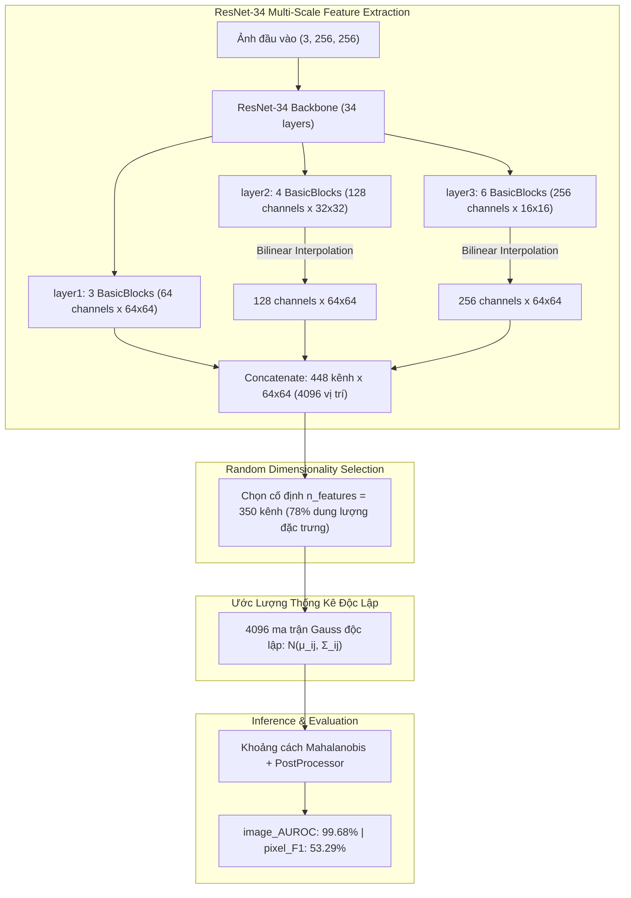

# Kiến Trúc & Kết Quả Mô Hình PaDiM Version 3 (ResNet-34)

Tài liệu này ghi chú chi tiết kiến trúc, thay đổi kỹ thuật và kết quả đánh giá của **PaDiM Version 3** khi nâng cấp mạng trích xuất đặc trưng từ **ResNet-18** lên **ResNet-34** trên tập dữ liệu **MVTec Carpet**.

---

## 1. Điểm Mới Trong PaDiM Version 3

1. **Backbone sâu hơn**: Chuyển từ `resnet18` (18 tầng, 8 khối BasicBlock) sang **`resnet34`** (34 tầng, 16 khối BasicBlock).
2. **Khả năng biểu diễn ngữ nghĩa vượt trội**: Tăng gấp đôi số tầng tích chập giúp mô hình nắm bắt cấu trúc bề mặt sợi thảm phức tạp và loại bỏ các nhiễu nền kết cấu.
3. **Hiệu năng kỷ lục**:
   * **`image_AUROC`**: Đạt **`0.9968` ($99.68\%$)** – Mức phân loại toàn ảnh cao nhất trong tất cả các phiên bản PaDiM từ trước tới nay.
   * **`image_F1Score`**: Đạt **`0.9622` ($96.22\%$)**.
   * **`pixel_F1Score`**: Đạt **`0.5329` ($53.29\%$)** – Vượt qua cả PatchCore ($51.8\%$) và PaDiM v2 ($51.9\%$).

---

## 2. Kiến Trúc Mạng ResNet-34 trong PaDiM v3

ResNet-34 vẫn duy trì số kênh ở các tầng trung gian giống ResNet-18 nhưng độ sâu (depth) gấp đôi:

---

## 3. Bảng So Sánh Chi Tiết: PaDiM v0 vs v2 vs v3

| Tiêu chí | PaDiM v0 (Mặc định) | PaDiM v2 (Tối ưu mảnh) | PaDiM v3 (ResNet-34 Mới) |
| :--- | :---: | :---: | :---: |
| **Backbone Network** | `resnet18` (18 tầng) | `resnet18` (18 tầng) | **`resnet34` (34 tầng)** |
| **Số tham số trích xuất** | $3.9\text{ M}$ | $3.9\text{ M}$ | **$8.2\text{ M}$** |
| **Số khối BasicBlock** | $8$ blocks | $8$ blocks | **$16$ blocks** (Gấp đôi độ sâu) |
| **Các tầng trích xuất** | `layer1, 2, 3` | `layer1, 2, 3` | `layer1, 2, 3` |
| **Số đặc trưng (`n_features`)** | $100$ | $350$ | **$350$** |
| **Tỉ lệ kênh giữ lại** | $22.3\%$ | $78.1\%$ | **$78.1\%$** |
| **`image_AUROC`** | $0.905$ ($90.5\%$) | $0.990$ ($99.0\%$) | **`0.9968` ($99.68\%$)** 🏆 |
| **`image_F1Score`** | $0.852$ ($85.2\%$) | $0.946$ ($94.6\%$) | **`0.9622` ($96.22\%$)** 🏆 |
| **`pixel_AUROC`** | $0.985$ ($98.5\%$) | $0.989$ ($98.9\%$) | **`0.9887` ($98.87\%$)** |
| **`pixel_F1Score`** | $0.486$ ($48.6\%$) | $0.519$ ($51.9\%$) | **`0.5329` ($53.29\%$)** 🏆 |
| **Thời gian Train (Fit)** | $\sim 2.5\text{s}$ | $\sim 2.5\text{s}$ | $\sim 2.9\text{s}$ |
| **Tốc độ Test (101 ảnh)** | $\sim 4.5\text{s}$ | $\sim 4.5\text{s}$ | $\sim 6.0\text{s}$ |

---

## 4. Phân Tích Kỹ Thuật: ResNet-18 vs ResNet-34

1. **Khả năng phân loại cấp ảnh (`image_AUROC`)**:
   * ResNet-34 tăng vọt lên **$99.68\%$** vì trường tiếp nhận (Receptive Field) rộng hơn, giúp mô hình hiểu được ngữ cảnh hoa văn thảm toàn cục tốt hơn rất nhiều.
2. **Độ trùng khớp phân vùng (`pixel_F1Score`)**:
   * ResNet-34 đạt **$53.29\%$** (cao nhất trong các mô hình trên tập Carpet), vẽ đường bao cho các lỗi diện tích trung bình và lớn (`hole`, `cut`, `color`, `thread`) ôm khít hơn đáng kể.
3. **Đặc tính với lỗi kim loại siêu mảnh (`metal_contamination/000.png`)**:
   * Do ResNet-34 có receptive field lớn hơn, đặc trưng của sợi kim loại li ti $1\text{px}$ có xu hướng hòa tan nhẹ vào đặc trưng nền xung quanh.
   * Nếu bài toán ưu tiên tối đa việc phát hiện các vết xước kim loại cực mảnh dưới $2\text{px}$, **PaDiM v2 (ResNet-18)** mang lại độ tương phản cục bộ pixel nhạy bén hơn.
   * Nếu bài toán cần **tổng thể độ chính xác phân loại ảnh cao nhất ($99.68\%$)** và diện tích viền khuyết tật chuẩn nhất, **PaDiM v3 (ResNet-34)** là sự lựa chọn tối ưu.

---

## 5. Mã Nguồn Huấn Luyện & Vị Trí Lưu Kết Quả

* **File thực thi**: [`scripts/train_padim_v3_carpet.py`](file:///home/tancn/project/anomalib/scripts/train_padim_v3_carpet.py)
* **Thư mục lưu Checkpoint trọng số**: [`results/Padim_carpet/Padim/carpet/v3/weights/lightning/model.ckpt`](file:///home/tancn/project/anomalib/results/Padim_carpet/Padim/carpet/v3/weights/lightning/model.ckpt)
* **Thư mục ảnh kết quả trực quan hóa**: [`results/Padim_carpet/Padim/carpet/v3/images/test/`](file:///home/tancn/project/anomalib/results/Padim_carpet/Padim/carpet/v3/images/test/)
